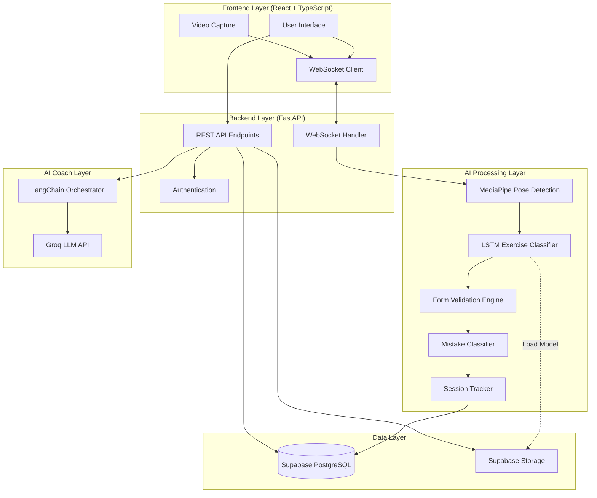

# FitMe

**AI-Powered Fitness Training Platform with Real-Time Form Correction**

## Overview

FitMe is a comprehensive fitness training application that leverages artificial intelligence and computer vision to provide real-time exercise form analysis and personalized coaching. The system uses MediaPipe for pose detection and a custom-trained LSTM model to classify exercises, offering instant feedback to prevent injuries and optimize workout effectiveness.

**Key Problem Solved:** Many people exercise incorrectly without realizing it, leading to injuries and reduced effectiveness. FitMe acts as a virtual personal trainer, providing immediate form corrections and tracking progress over time.

**Core Innovation:** Real-time biomechanical analysis using pose estimation combined with exercise-specific form validation rules, enabling detailed feedback on body alignment, joint angles, and movement patterns.

## Features

### Core Functionality
- **Real-Time Pose Detection** - MediaPipe-based skeletal tracking with 33 landmark points
- **Exercise Classification** - LSTM model trained to recognize squats, push-ups, sit-ups, and other exercises
- **Form Correction Feedback** - Biomechanical analysis with specific corrections for common mistakes
- **Live Training Sessions** - WebSocket-based real-time feedback during camera workouts
- **Video Upload Analysis** - Upload recorded workout videos for detailed post-training analysis

### Training & Tracking
- **Session Tracking** - Comprehensive workout history with rep counts and form scores
- **Mistake Classification** - Categorized form errors with severity levels (high/medium/low)
- **Injury Risk Warnings** - Real-time alerts for high-risk movements
- **Performance Reports** - Detailed session summaries with metrics and improvement suggestions
- **Weight Tracking** - Progress monitoring with historical data visualization

### Personalization
- **AI Coach Chatbot** - LangChain-powered conversational assistant using Groq LLM (Llama 3.3 70B)
- **Nutrition Planning** - Personalized meal plans and calorie tracking
- **User Profiles** - Customizable fitness goals and preferences
- **Dashboard Analytics** - Visual statistics and progress charts

### Accessibility
- **Multi-Language Support** - English and Arabic UI translations
- **Responsive Design** - Mobile and desktop optimized interface
- **Voice Feedback** - Audio cues during workouts (optional)

## Technologies & Tools

### Programming Languages
- **Python 3.10+** - Backend and AI processing
- **TypeScript** - Frontend type-safe development

### Backend Framework
- **FastAPI** - High-performance async API framework
- **Uvicorn** - ASGI server with WebSocket support
- **Pydantic** - Data validation and settings management

### AI/ML Stack
- **TensorFlow 2.18** - Deep learning model training and inference
- **MediaPipe 0.10** - Real-time pose estimation
- **OpenCV** - Video processing and frame manipulation
- **scikit-learn** - Model evaluation and preprocessing
- **NumPy** - Numerical computations for angle calculations

### Frontend Framework
- **React 18** - Component-based UI library
- **Vite** - Fast build tool and dev server
- **Material-UI (MUI)** - Component library and design system
- **Framer Motion** - Animation library
- **Recharts** - Data visualization charts

### State Management & Routing
- **Zustand** - Lightweight state management
- **React Router** - Client-side routing
- **React Hook Form** - Form handling with Zod validation

### Database & Storage
- **Supabase** - PostgreSQL database with authentication
- **Supabase Storage** - Model file storage and retrieval

### AI Coach & LLM
- **LangChain** - LLM orchestration framework
- **Groq** - Fast LLM inference API (Llama 3.3 70B model)

### Development Tools
- **ESLint** - JavaScript/TypeScript linting
- **Autoprefixer & PostCSS** - CSS processing
- **Tailwind CSS** - Utility-first CSS framework

## System Architecture

FitMe follows a three-tier architecture with real-time communication:



### Workflow

1. **User Authentication** - User logs in via Supabase authentication
2. **Session Initialization** - Frontend starts live session or uploads video
3. **Frame Streaming** - Video frames sent to backend via WebSocket
4. **Pose Detection** - MediaPipe extracts 33 body landmarks per frame
5. **Exercise Classification** - LSTM model identifies exercise type from pose sequence
6. **Form Analysis** - Biomechanical rules calculate joint angles and validate posture
7. **Mistake Detection** - Classifier categorizes form errors by severity
8. **Real-Time Feedback** - Corrections streamed back to frontend via WebSocket
9. **Session Tracking** - Metrics stored in database for history and analytics
10. **Report Generation** - Post-session summary with insights and recommendations

## Project Structure

```
FitMe/
├── backend/                          # FastAPI Backend Server
│   ├── app/
│   │   ├── main.py                   # Application entry point with lifespan management
│   │   ├── config.py                 # Environment configuration (Pydantic settings)
│   │   ├── ai/                       # AI & Computer Vision Modules
│   │   │   ├── form_checks.py        # Biomechanical validation rules
│   │   │   └── pose_utils.py         # MediaPipe pose utilities
│   │   ├── reports/                  # Session Tracking & Reporting
│   │   │   ├── session_tracker.py    # Workout session state management
│   │   │   ├── mistake_classifier.py # Form error categorization
│   │   │   └── report_generator.py   # Post-session report creation
│   │   ├── routes/                   # API Route Handlers
│   │   │   ├── auth.py               # Authentication endpoints
│   │   │   ├── users.py              # User profile management
│   │   │   ├── sessions.py           # Live training sessions
│   │   │   ├── videos.py             # Video upload analysis
│   │   │   ├── reports.py            # Workout reports
│   │   │   ├── dashboard.py          # Analytics statistics
│   │   │   ├── weight.py             # Weight tracking
│   │   │   ├── coach.py              # AI chatbot endpoints
│   │   │   └── nutrition.py          # Meal planning
│   │   ├── services/                 # Business Logic Services
│   │   │   ├── supabase_service.py   # Database client wrapper
│   │   │   ├── session_service.py    # Session management logic
│   │   │   ├── video_service.py      # Video processing pipeline
│   │   │   └── ai_coach_service.py   # LangChain + Groq integration
│   │   └── websockets/               # Real-Time Communication
│   │       └── live_handler.py       # WebSocket frame processing
│   ├── trained_pose_model/           # Trained AI Models
│   │   ├── best_model.keras          # Primary LSTM exercise classifier
│   │   ├── lstm_model.keras          # Alternative model
│   │   └── label_encoder.npy         # Exercise class labels
│   ├── requirements.txt              # Python dependencies
│   ├── .env.example                  # Environment variable template
│   └── gradvenv/                     # Virtual environment (not in repo)
│
├── Ui/                               # React Frontend Application
│   ├── src/
│   │   ├── main.tsx                  # Application entry point
│   │   ├── App.tsx                   # Root component with routing
│   │   ├── api/                      # API Client Layer
│   │   │   ├── client.ts             # Axios configuration
│   │   │   ├── auth.ts               # Authentication API
│   │   │   ├── sessions.ts           # Session API
│   │   │   ├── videos.ts             # Video upload API
│   │   │   ├── reports.ts            # Reports API
│   │   │   ├── dashboard.ts          # Dashboard API
│   │   │   ├── weight.ts             # Weight tracking API
│   │   │   ├── coach.ts              # AI coach API
│   │   │   └── nutrition.ts          # Nutrition API
│   │   ├── pages/                    # Page Components
│   │   │   ├── auth/                 # Login, register, forgot password
│   │   │   ├── dashboard/            # Main dashboard
│   │   │   ├── live-training/        # Live camera workout
│   │   │   ├── reports/              # Session history
│   │   │   ├── profile/              # User profile
│   │   │   ├── workout/              # Workout library
│   │   │   ├── ai-coach/             # Chatbot interface
│   │   │   ├── nutrition/            # Meal planning
│   │   │   └── settings/             # App settings
│   │   ├── components/               # Reusable Components
│   │   │   ├── live-training/        # Webcam, feedback display
│   │   │   ├── upload/               # Video upload UI
│   │   │   ├── charts/               # Data visualization
│   │   │   ├── dashboard/            # Dashboard widgets
│   │   │   └── ui/                   # Shared UI components
│   │   ├── hooks/                    # Custom React Hooks
│   │   │   ├── useLiveSession.ts     # Live training session logic
│   │   │   ├── useWebSocket.ts       # WebSocket connection
│   │   │   ├── useVideoUpload.ts     # Video upload handling
│   │   │   ├── useFrameCapture.ts    # Webcam frame capture
│   │   │   └── useVoiceFeedback.ts   # Text-to-speech feedback
│   │   ├── services/                 # Frontend Services
│   │   ├── types/                    # TypeScript type definitions
│   │   ├── translations/             # i18n language files
│   │   │   ├── en.ts                 # English translations
│   │   │   └── ar.ts                 # Arabic translations
│   │   ├── app/                      # App Configuration
│   │   │   ├── store.ts              # Zustand state management
│   │   │   ├── theme.ts              # MUI theme configuration
│   │   │   └── i18n.ts               # i18next configuration
│   │   └── utils/                    # Utility Functions
│   ├── package.json                  # Node dependencies
│   ├── tsconfig.json                 # TypeScript configuration
│   ├── vite.config.ts                # Vite build configuration
│   └── tailwind.config.js            # Tailwind CSS configuration
│
└── README.md                         # Project documentation
```

## Installation & Setup

### Prerequisites

- **Python 3.10 or higher** - [Download](https://www.python.org/downloads/)
- **Node.js 18+ and npm** - [Download](https://nodejs.org/)
- **Supabase Account** - [Sign up](https://supabase.com/)
- **Groq API Key** (optional for AI coach) - [Get key](https://console.groq.com/)

### Backend Setup

1. **Navigate to backend directory:**
   ```bash
   cd backend
   ```

2. **Create and activate virtual environment:**
   ```bash
   python -m venv gradvenv
   
   # Windows
   gradvenv\Scripts\activate
   
   # macOS/Linux
   source gradvenv/bin/activate
   ```

3. **Install dependencies:**
   ```bash
   pip install -r requirements.txt
   ```

4. **Configure environment variables:**
   
   Create a `.env` file in the `backend/` directory:
   ```bash
   cp .env.example .env
   ```
   
   Edit `.env` with your credentials:
   ```env
   # Supabase Configuration
   SUPABASE_URL=your_supabase_project_url
   SUPABASE_SERVICE_KEY=your_supabase_service_role_key
   
   # Security
   SECRET_KEY=your_secret_key_here_use_openssl_rand_hex_32
   
   # AI Coach (Optional)
   GROQ_API_KEY=your_groq_api_key
   COACH_MODEL=llama-3.3-70b-versatile
   
   # Environment
   ENVIRONMENT=development
   
   # CORS
   ALLOWED_ORIGINS=http://localhost:5173,http://localhost:3000
   
   # Model Configuration
   MODEL_DIR=./trained_pose_model
   ```

5. **Set up model files:**
   
   The application automatically downloads model files from Supabase Storage on first run. Alternatively, place your trained models in `backend/trained_pose_model/`:
   - `best_model.keras` or `lstm_model.keras`
   - `label_encoder.npy`

### Frontend Setup

1. **Navigate to UI directory:**
   ```bash
   cd Ui
   ```

2. **Install dependencies:**
   ```bash
   npm install
   ```

3. **Configure API endpoint (optional):**
   
   The frontend is pre-configured to connect to `http://localhost:8000`. To change this, update `Ui/src/api/client.ts`:
   ```typescript
   const API_BASE_URL = 'http://localhost:8000';
   ```

## Configuration / Environment Variables

### Backend Environment Variables

| Variable | Description | Required | Default |
|----------|-------------|----------|---------|
| `SUPABASE_URL` | Your Supabase project URL | Yes | - |
| `SUPABASE_SERVICE_KEY` | Supabase service role key | Yes | - |
| `SECRET_KEY` | JWT signing secret (generate with `openssl rand -hex 32`) | Yes | - |
| `GROQ_API_KEY` | Groq API key for AI coach chatbot | No | - |
| `COACH_MODEL` | LLM model name | No | `llama-3.3-70b-versatile` |
| `ENVIRONMENT` | Environment name (development/production) | No | `development` |
| `ALLOWED_ORIGINS` | Comma-separated CORS origins | No | `http://localhost:5173,http://localhost:3000` |
| `MODEL_DIR` | Path to trained model directory | No | `./trained_pose_model` |
| `MAX_UPLOAD_SIZE_MB` | Max video upload size in MB | No | `500` |
| `TEMP_VIDEO_DIR` | Temporary directory for video processing | No | `/tmp/fitpose_videos` |

**Security Note:** Never commit actual API keys or secrets to version control. Use `.env` files locally and environment variables in production.

## Running the Project

### Start Backend Server

```bash
cd backend
gradvenv\Scripts\activate  # On Windows
# source gradvenv/bin/activate  # On macOS/Linux
uvicorn app.main:app --reload --port 8000
```

Server will start at: **http://localhost:8000**

API Documentation: **http://localhost:8000/docs** (Swagger UI)

Health Check: **http://localhost:8000/health**

### Start Frontend Development Server

```bash
cd Ui
npm run dev
```

Application will start at: **http://localhost:5173**

### Running Both Services

Open two terminal windows and run the backend and frontend commands separately.

## Usage

### Getting Started

1. **Create Account**
   - Navigate to http://localhost:5173
   - Click "Sign Up" and create your account
   - Complete onboarding with your fitness goals

2. **Start Live Training**
   - Click "Start Workout" from the dashboard
   - Select an exercise (squat, push-up, sit-up)
   - Grant camera permissions
   - Follow on-screen form corrections in real-time

3. **Upload Video**
   - Go to "Video Upload" page
   - Select a workout video (max 500MB)
   - Choose exercise type
   - System will analyze and provide detailed feedback

4. **View Reports**
   - Access "Reports" from sidebar
   - Review session history with form scores
   - Check mistake patterns and injury risks
   - Track progress over time

5. **AI Coach Chatbot**
   - Open "AI Coach" from navigation
   - Ask questions about exercises, form, or nutrition
   - Get personalized training advice

### Example Workflow

```
User Login → Dashboard → Start Live Workout → Select Exercise (Squat) 
→ Camera Activates → Real-Time Pose Detection → Form Analysis 
→ Instant Feedback ("Keep chest up") → Session Complete 
→ Report Generated → View Analytics → Track Progress
```

## Models / Dataset

### Exercise Classification Model

- **Architecture:** LSTM (Long Short-Term Memory) neural network
- **Input:** Sequence of 33 MediaPipe pose landmarks (x, y, z coordinates) over multiple frames
- **Output:** Exercise classification (squat, push_up, sit_up, etc.)
- **Model File:** `best_model.keras` or `lstm_model.keras` (TensorFlow Keras format)
- **Label Encoder:** `label_encoder.npy` - Maps model output indices to exercise names

### Pose Detection

- **Technology:** Google MediaPipe Pose
- **Landmarks:** 33 body keypoints including shoulders, elbows, wrists, hips, knees, ankles
- **Processing:** Real-time inference on CPU (GPU disabled for broader compatibility)

### Form Validation Rules

Implemented in `backend/app/ai/form_checks.py`:

**Squats:**
- Knee angle (hip-knee-ankle) for depth assessment
- Torso lean angle relative to vertical
- Knee tracking (forward projection)
- Back rounding detection via shoulder-hip alignment

**Push-ups:**
- Back straightness (shoulder-hip-knee angle)
- Elbow bend angle (target ~90°)
- Body plank alignment

**Sit-ups:**
- Torso curl angle
- Neck positioning to prevent strain
- Knee bend validation

### Model Loading

Models are automatically downloaded from Supabase Storage on first application startup if not found locally. The system gracefully handles missing models and logs errors for debugging.

## Future Improvements

- **Additional Exercises** - Lunges, planks, burpees, deadlifts, and more
- **Progressive Overload Tracking** - Automatic weight/rep progression recommendations
- **Social Features** - Workout sharing, challenges, and leaderboards
- **Wearable Integration** - Heart rate and calorie tracking from fitness devices
- **3D Pose Visualization** - Enhanced skeleton rendering with depth perception
- **Mobile App** - Native iOS and Android applications
- **Offline Mode** - Local model inference without internet connection
- **Multi-Person Detection** - Group workout sessions with multiple camera streams
- **Advanced Biomechanics** - Velocity, acceleration, and power output analysis
- **Physical Therapy Mode** - Rehabilitation exercise tracking with therapist dashboard

---

**Built as a graduation project to demonstrate the practical application of AI and computer vision in fitness technology.**
